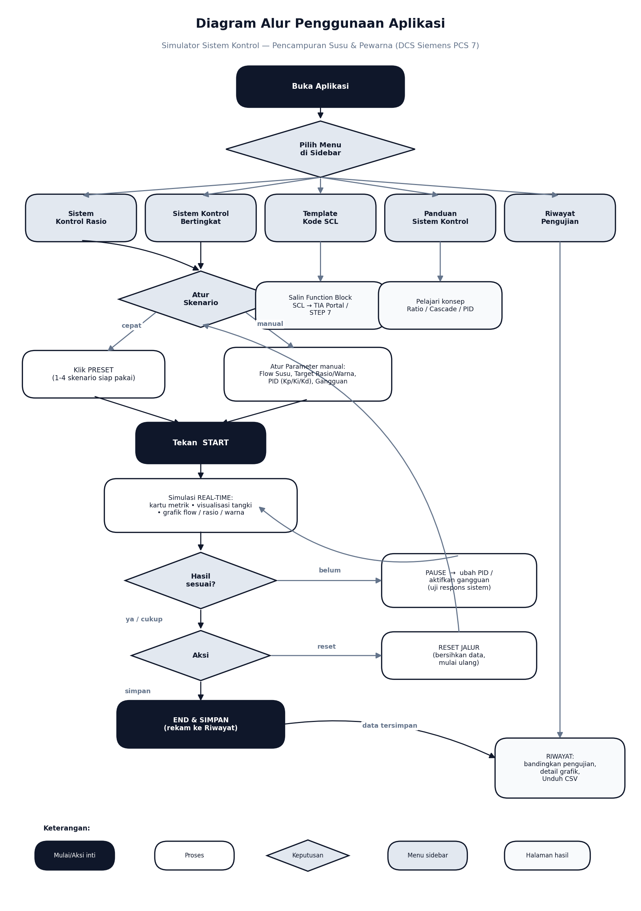

# Panduan Lengkap Aplikasi — Simulator Sistem Kontrol Pencampuran Susu & Pewarna

Dokumen ini menjelaskan **seluruh halaman, seluruh tombol, dan seluruh field** pada aplikasi
secara detail. Disusun agar setiap kontrol dapat dipahami tanpa membuka kode sumber.

> Aplikasi dibuat dengan **Streamlit** dan menyimulasikan dua arsitektur kendali industri
> (**Ratio Control** dan **Cascade Control**) untuk proses pencampuran susu (*wild flow*) dengan
> cairan pewarna (*controlled flow*), divalidasi sensor warna **TCS3200**, lengkap dengan
> generator kode **SCL Siemens PCS 7**.

---

## Diagram Alur Penggunaan

Alur ringkas: **Buka aplikasi → pilih menu sidebar → (Ratio/Cascade) atur skenario via Preset
atau parameter manual → START → amati simulasi real-time → evaluasi → End & Simpan / Reset →
analisis di Riwayat**. Halaman SCL dan Panduan bersifat referensi.

---

## 0. Kerangka Umum & Sidebar

Sidebar tampil di setiap halaman dan berisi navigasi utama.

| Elemen | Fungsi |
|---|---|
| **Sistem Kontrol Rasio** | Buka halaman simulasi Ratio Control. |
| **Sistem Kontrol Bertingkat** | Buka halaman simulasi Cascade Control. |
| **Template Kode SCL PCS 7** | Buka halaman generator kode SCL Siemens. |
| **Panduan Sistem Kontrol** | Buka halaman teori/konsep. |
| **Riwayat Pengujian** | Buka halaman rekaman hasil simulasi tersimpan. |
| **Hapus Cache** | Membersihkan cache Streamlit (`st.cache_data` & `st.cache_resource`) bila tampilan terasa tidak ter-refresh. |

**Tombol menu yang aktif** ditandai warna gelap (primary); lainnya abu-abu (secondary).

**Konstanta proses (berlaku di semua simulasi):**

| Konstanta | Nilai | Arti |
|---|---|---|
| Sample time (`dt`) | 0.1 s | Periode cuplik PID (100 ms), sama dengan template SCL. |
| Langkah per refresh | 5 | Tiap siklus layar memajukan simulasi 5×0.1 = 0.5 detik. |
| Laju pewarna maks | 15 L/min | Kapasitas penuh katup pewarna (100% bukaan). |
| Laju susu nominal | 50 L/min | Nilai awal *wild flow* sebelum diubah/diganggu. |
| Konstanta waktu katup | 0.8 s | Lag aktuator katup (first-order lag). |
| Transport delay sensor | 2.0 s | Waktu tunda campuran mencapai sensor TCS3200 (dead time). |

---

## 1. Halaman: Sistem Kontrol Rasio (Ratio Control)

Menjaga **perbandingan tetap** antara laju susu (Wild Flow / PV) dan laju pewarna (Slave Flow / MV):
`Setpoint pewarna = K_ratio × laju susu`, lalu PID mengatur katup mengejar setpoint itu.

### 1A. Panel kiri — Presets & Skenario Simulasi

Tombol preset langsung mengisi semua parameter dan **otomatis menjalankan** simulasi.

| Tombol Preset | Yang di-set (Rasio, Kp, Ki, Kd, Gangguan Susu, Katup Tersumbat) |
|---|---|
| **1. Rasio Ringan (5%)** | 0.05 · 2.5 · 1.5 · 0.1 · off · off |
| **2. Rasio Pekat (15%)** | 0.15 · 2.5 · 1.5 · 0.1 · off · off |
| **3. Tes Gangguan Laju Susu** | 0.10 · 2.5 · 1.5 · 0.1 · **on** · off |
| **4. Tes Gangguan Valve Tersumbat** | 0.10 · 3.5 · 2.0 · 0.15 · off · **on** (PID dibuat lebih agresif) |

### 1B. Panel kiri — Parameter Kontrol

| Field | Tipe & Rentang | Penjelasan Detail |
|---|---|---|
| **Flow Susu Input (Nominal) [L/min]** | Slider 20–90, step 1 | `Flow_Susu_Input` — laju susu nominal (Wild Flow / PV). Setpoint pewarna mengikuti nilai ini (SP = K_ratio × laju susu). **Saat "Fluktuasi Laju Susu Ekstrem" aktif, nilai ini di-override** oleh step disturbance. |
| **Target Rasio (Pewarna : Susu)** | Slider 0.02–0.20 | `K_ratio` — perbandingan laju pewarna terhadap susu. Mis. 0.10 = pewarna 10% dari laju susu. ↑ rasio → campuran makin pekat. |
| **Mode Operasi** | Radio: *Auto (PID)* / *Manual* | **Auto**: PID otomatis mengatur bukaan katup agar rasio sesuai target. **Manual**: bukaan katup diatur sendiri (uji *open-loop*). |
| **Bukaan Katup Manual (%)** | Slider 0–100 *(muncul hanya saat mode Manual)* | Memaksa posisi katup pewarna. 0% = tertutup, 100% = terbuka penuh. |
| **Kp (Proportional)** | Slider 0.1–10 | Penguatan sebanding besar error (SP − aliran aktual). ↑ → cepat/agresif tapi rawan overshoot & osilasi. |
| **Ki (Integral)** | Slider 0–5 | Mengakumulasi error untuk menghapus sisa error tetap (*offset*/steady-state error). Terlalu besar → osilasi & lambat. |
| **Kd (Derivative)** | Slider 0–2 | Meredam berdasarkan laju perubahan pengukuran (*derivative-on-measurement*). Terlalu besar → memperkuat noise sensor. |
| **Fluktuasi Laju Susu Ekstrem** | Checkbox | Mengaktifkan step disturbance: laju susu berayun **75 ↔ 35 L/min** tiap 10 detik untuk menguji *load rejection*. |
| **Simulasi Katup Tersumbat** | Checkbox | Mengurangi kapasitas aliran pewarna menjadi 40% (`clogging_factor` = 0.4) untuk menguji koreksi PID. |

### 1C. Panel kiri — Tombol kendali simulasi

| Tombol | Aksi |
|---|---|
| **Start** | Mulai/lanjutkan simulasi real-time. |
| **Pause** | Hentikan sementara (data tetap tersimpan, bisa dilanjut). |
| **End & Simpan** | Hentikan + **rekam hasil** (parameter, metrik, data, grafik) ke halaman Riwayat. Jika belum ada data, muncul peringatan. |
| **Reset Jalur** | Hapus seluruh data simulasi & kembalikan kondisi awal. |

### 1D. Panel kanan — Kartu Metrik (real-time)

| Kartu | Isi |
|---|---|
| **Aliran Susu (Wild)** | Laju susu aktual saat ini (L/min). |
| **Aliran Pewarna (Slave)** | Laju pewarna aktual **/ setpoint (SP)** (L/min). |
| **Bukaan Katup** | Posisi katup pewarna aktual (%) — Manipulated Variable. |
| **Sensor TCS3200** | Nilai intensitas warna campuran + badge **SESUAI** (deviasi ≤ 10%) / **DEVIASI**. |

### 1E. Panel kanan — Visualisasi & Grafik

- **Visualisasi Proses Pencampuran** — animasi pipa susu (putih) + pipa pewarna (gelap, opasitas mengikuti laju) → tangki yang **warnanya berubah dinamis** sesuai rasio aktual, dengan label sensor TCS3200 *downstream*.
- **Grafik 1 — Laju Aliran Bahan Pencampur**: Aliran Susu, Aliran Pewarna, dan Setpoint Pewarna (garis putus-putus) vs waktu.
- **Grafik 2 — Respons Bukaan Katup vs Deviasi Rasio**: Bukaan Katup (%), Rasio Aktual (%), dan Target Rasio (%) vs waktu.
- Grafik menampilkan **150 titik data terakhir**. Bila belum dijalankan, muncul info untuk menekan Start/Preset.

---

## 2. Halaman: Sistem Kontrol Bertingkat (Cascade Control)

Dua loop PID seri: **Loop Luar (Primary)** mengontrol warna (baca TCS3200) → menghasilkan
**setpoint laju pewarna** → **Loop Dalam (Secondary)** mengatur katup mengejar setpoint laju itu
secepat mungkin (meredam gangguan tekanan sebelum sempat mempengaruhi warna).

### 2A. Panel kiri — Presets & Skenario Simulasi

| Tombol Preset | Yang di-set (Warna, Kp_o, Ki_o, Kd_o, Kp_i, Ki_i, Kd_i, Gangguan Susu, Tekanan Drop) |
|---|---|
| **1. Target Warna Ringan (50)** | 50 · 0.10 · 0.02 · 0.0 · 2.0 · 1.2 · 0.05 · off · off |
| **2. Target Warna Gelap (120)** | 120 · 0.18 · 0.04 · 0.01 · 2.8 · 1.8 · 0.10 · off · off |
| **3. Tes Redam Tekanan Drop** | 100 · 0.15 · 0.03 · 0.01 · 2.5 · 1.5 · 0.10 · off · **on** |
| **4. Gangguan Aliran & Susu** | 100 · 0.20 · 0.04 · 0.01 · 3.0 · 2.0 · 0.10 · **on** · **on** |

### 2B. Panel kiri — Parameter Kontrol

| Field | Tipe & Rentang | Penjelasan Detail |
|---|---|---|
| **Target Intensitas Warna (0–200)** | Slider 20–200 | Setpoint utama (SP): nilai warna produk akhir yang dibaca TCS3200. ↑ → produk makin gelap. |
| **Mode Operasi** | Radio: *Auto (Cascade PID)* / *Manual* | **Auto**: dua loop PID (warna → aliran) bekerja bertingkat. **Manual**: katup diatur sendiri. |
| **Bukaan Katup Manual (%)** | Slider 0–100 *(muncul hanya saat mode Manual)* | Memaksa posisi katup pewarna. |
| **Loop Luar — Kp (Outer)** | Slider 0.01–1.0 | Penguatan error warna (target − warna terukur). Outputnya = target laju pewarna. Dibuat kecil karena ada *dead time*. |
| **Loop Luar — Ki (Outer)** | Slider 0–0.5 | Menghapus *offset* warna akhir. |
| **Loop Luar — Kd (Outer)** | Slider 0–0.2 | Meredam osilasi warna akibat keterlambatan sensor. |
| **Loop Dalam — Kp (Inner)** | Slider 0.1–10 | Penguatan error aliran (SP loop luar − laju aktual). Dibuat agresif agar cepat meredam gangguan tekanan. |
| **Loop Dalam — Ki (Inner)** | Slider 0–5 | Menghapus sisa error laju aliran pewarna. |
| **Loop Dalam — Kd (Inner)** | Slider 0–2 | Meredam lonjakan aliran (*derivative-on-measurement*). |
| **Fluktuasi Laju Susu Ekstrem** | Checkbox | Step disturbance laju susu 75 ↔ 35 L/min tiap 10 detik. |
| **Tekanan Pewarna Drop 50%** | Checkbox | Menurunkan kapasitas aliran pewarna 50% (gangguan loop dalam) untuk menguji kecepatan loop sekunder. |

### 2C. Panel kiri — Tombol kendali

Sama persis dengan Ratio Control: **Start · Pause · End & Simpan · Reset Jalur** (lihat 1C).

### 2D. Panel kanan — Kartu Metrik

| Kartu | Isi |
|---|---|
| **Aliran Susu (Wild)** | Laju susu aktual (L/min). |
| **Aliran Pewarna (Slave)** | Laju pewarna aktual **/ SP** (target dari loop luar). |
| **Bukaan Katup** | Posisi katup pewarna (%). |
| **Sensor TCS3200** | Warna terukur **/ SP** + badge **STABIL** (deviasi ≤ 5%) / **DEVIASI**. |

### 2E. Panel kanan — Visualisasi & Grafik

- **Visualisasi Proses Pencampuran** — sama seperti Ratio: tangki berubah warna real-time + sensor *downstream*.
- **Grafik 1 — Laju Aliran (Secondary Loop)**: Aliran Susu, Aliran Pewarna, Setpoint Aliran.
- **Grafik 2 — Kontrol Kualitas Warna Akhir (Primary Loop)**: Warna Sensor TCS3200 vs Target Warna.
- **Grafik 3 — Bukaan Katup Kendali (Manipulated Variable)**: posisi katup (%) vs waktu.

---

## 3. Halaman: Template Kode SCL Siemens PCS 7

Menampilkan kode **SCL (Structured Control Language)** siap pakai untuk TIA Portal / STEP 7,
dengan logika identik simulator (PID periode 0.1 s, anti-windup, derivative-on-measurement).

| Tab | Isi |
|---|---|
| **Sistem Kontrol Rasio** | `FUNCTION_BLOCK FB_RatioControl` + petunjuk integrasi (buat source SCL → tempel → kompilasi jadi FB → masukkan ke CFC). |
| **Sistem Kontrol Bertingkat** | `FUNCTION_BLOCK FB_CascadeControl` + penjelasan kenapa cascade memakai blok tunggal (hemat memori, anti-windup antar-loop, propagasi mode Auto/Manual sinkron). |

Setiap tab memiliki blok kode (dengan tombol salin bawaan Streamlit) dan kotak info petunjuk.

---

## 4. Halaman: Panduan Sistem Kontrol

Referensi teori (tanpa input). Tiga bagian:

1. **Sistem Kontrol Rasio** — definisi Wild Flow vs Controlled Flow, diagram logika, kelebihan & kekurangan.
2. **Sistem Kontrol Bertingkat** — peran loop luar & dalam, diagram logika, alasan keunggulan terhadap gangguan tekanan.
3. **Implementasi Algoritma PID** — rumus diskret (P, I, D), penjelasan Kp/Ki/Kd, *derivative-on-measurement*, dan *anti-windup* — konsisten dengan template SCL.

---

## 5. Halaman: Riwayat Pengujian

Menyimpan hasil dari tombol **End & Simpan**. Data bertahan selama sesi aplikasi berjalan.

### 5A. Ringkasan Seluruh Pengujian (tabel)

Kolom: **ID · Waktu · Jenis (Ratio/Cascade) · Durasi (s) · Jumlah Data · MAE · Validasi OK (%) · Parameter**.
- Tombol **Hapus Semua Riwayat** mengosongkan seluruh rekaman.

### 5B. Detail Pengujian

| Elemen | Fungsi |
|---|---|
| **Pilih pengujian** (selectbox) | Memilih satu rekaman berdasarkan ID + jenis + waktu. |
| **Kartu metrik** | *Jenis Kontrol*, *Durasi Uji*, *MAE* (Mean Absolute Error), *Validasi Lolos %* (badge hijau bila ≥ 70%). |
| **Parameter yang digunakan** (expander) | Menampilkan seluruh parameter rekaman dalam format JSON. |
| **Grafik Hasil Pengujian** | Ratio → grafik laju aliran + Rasio Aktual vs Target. Cascade → grafik warna vs target + aliran/bukaan katup. |
| **Tabel Data Lengkap** | Seluruh deret waktu (dibulatkan 3 desimal), tinggi 300 px. |
| **Unduh Data (CSV)** | Mengekspor data rekaman ke berkas `pengujian_<jenis>_<id>.csv`. |

### Cara metrik dihitung

- **MAE (Ratio)** = rata-rata `|aliran pewarna − setpoint pewarna|` (label: *MAE Aliran (L/min)*).
- **MAE (Cascade)** = rata-rata `|warna terukur − target warna|` (label: *MAE Warna*).
- **Validasi OK (%)** = persentase langkah waktu yang lolos toleransi sensor (Ratio ±10%, Cascade ±5%).
- **Durasi** = waktu simulasi terakhir; **Jumlah Data** = banyak titik sampel.

---

## Catatan Teknis Tambahan

- **Animasi real-time** dijalankan dengan pola `time.sleep(0.08)` + `st.rerun()` di akhir skrip, hanya saat
  simulasi berjalan pada halaman Ratio/Cascade.
- **Derivative-on-Measurement** dipakai di PID agar tidak terjadi *derivative kick* saat setpoint berubah
  mengikuti fluktuasi laju susu.
- **Anti-windup**: ketika output katup tersaturasi (0% atau 100%), akumulasi integral dikembalikan (clamp)
  agar pemulihan tidak melambat.
- Shortcut keyboard `c` (Clear Caches) dan `r` (Rerun) bawaan Streamlit di-*intercept* agar tidak mengganggu
  Ctrl+C / penyalinan teks.
